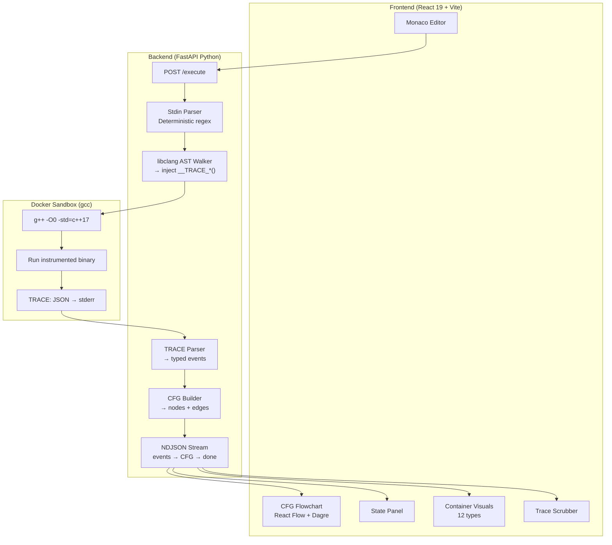
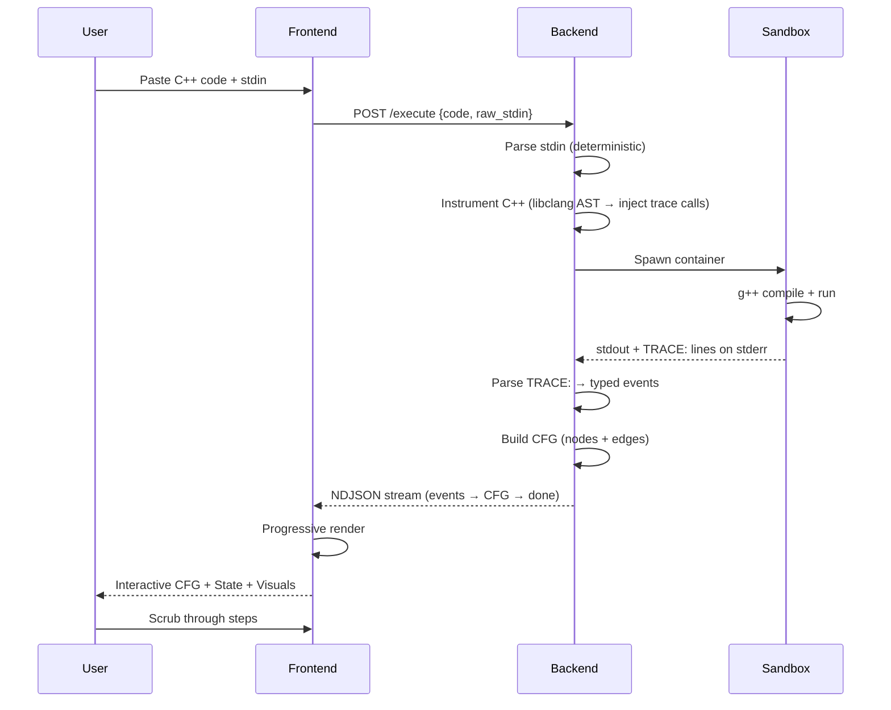

# Architecture

Source of truth for AlgoTheseus system diagrams. The overview copies below also live in
`README.md` (Architecture zone, lines 197–268); this file is canonical — update here first,
then mirror to the README.

## System Overview

## Pipeline Detail

## Components

Every row names a real repo path (all verified with `test -e`).

| Component | Path | Role |
|---|---|---|
| API entry | `backend/app/main.py` | FastAPI app, CORS, route registration |
| Execute routes | `backend/app/api/routes/execute.py` | `POST /execute`, `/execute-batch`, NDJSON streaming |
| AST walker | `backend/app/core/instrumenter/ast_walker.py` | libclang AST → trace injection points |
| Trace runtime | `backend/app/core/instrumenter/tracer.h` | C++ runtime logger injected into user code |
| Source rewriter | `backend/app/core/instrumenter/injector.py` | Applies injection points to user source |
| Scope tracker | `backend/app/core/instrumenter/scope_tracker.py` | Variable scope map per function |
| Sandbox runner | `backend/app/core/executor/docker_runner.py` | Spawns sandbox containers, collects output |
| Sandbox limits | `backend/app/core/executor/sandbox_config.py` | Resource limits (128MB, 10s timeout) |
| Trace parser | `backend/app/core/trace/parser.py` | `TRACE:` stderr lines → typed events |
| Event models | `backend/app/core/trace/models.py` | Pydantic event models (source of truth) |
| CFG builder | `backend/app/core/trace/cfg_builder.py` | Trace events → CFG nodes + edges |
| Stdin parser | `backend/app/core/stdin/parser.py` | Deterministic stdin cleaner (regex, no LLM) |
| Sandbox image | `backend/docker/Dockerfile.sandbox` | gcc execution sandbox image |
| CFG view | `frontend/src/components/FlowChart` | React Flow flowchart + custom nodes/edges |
| CFG layout | `frontend/src/utils/cfgLayout.ts` | Dagre hierarchical layout for CFG nodes |
| Client state | `frontend/src/store` | Zustand stores (traceStore, cfgStore, uiStore) |
| Local orchestration | `docker-compose.yml` | Canonical local quickstart wiring |

## Pipeline Stages

| # | Stage | Input → Output | Owned by |
|---|---|---|---|
| 1 | Stdin clean | raw stdin → clean stdin | `backend/app/core/stdin/parser.py` |
| 2 | Instrument | C++ source → instrumented source | `backend/app/core/instrumenter/ast_walker.py` + `injector.py` |
| 3 | Compile | instrumented source → binary | sandbox `g++ -O0 -std=c++17` |
| 4 | Run | binary → stdout + `TRACE:` stderr | `backend/app/core/executor/docker_runner.py` |
| 5 | Parse | `TRACE:` lines → typed events | `backend/app/core/trace/parser.py` over `models.py` |
| 6 | CFG build | events → nodes + edges | `backend/app/core/trace/cfg_builder.py` |
| 7 | Stream + render | CFG → NDJSON → interactive UI | `execute.py` → `FlowChart` + `cfgLayout.ts` |

## Design Decisions

Expanded from `README.md` Design Decisions (lines 434–459); each points at the file that carries it.

1. **libclang over regex** — C++ grammar is not regular; one missed edge case in a regex
   parser silently corrupts the trace. libclang provides the full AST (templates, macros,
   overload resolution). Pointer: `backend/app/core/instrumenter/ast_walker.py`.
2. **Instrumentation over GDB** — GDB tracing is slow (~1ms/step), fragile (debug symbols),
   and hard to sandbox. Instrumentation compiles to native speed and emits exactly the
   events needed. Pointer: `backend/app/core/instrumenter/tracer.h`.
3. **Dynamic CFG over static analysis** — static C++ CFG analysis is extremely complex
   (templates, macros, virtual dispatch). Building the CFG from the trace is simpler, always
   correct, and shows only paths actually taken.
   Pointer: `backend/app/core/trace/cfg_builder.py`.
4. **No LLM** — pure deterministic pipeline: no external API calls, model downloads, or keys;
   the image stays ~2GB instead of ~15GB with Ollama. Stdin cleaning is regex-based.
   Pointer: `backend/app/core/stdin/parser.py`.
5. **Dagre for layout** — sequential `y = i * 80` stacking makes branches look linear; Dagre's
   hierarchical layout forks branch nodes left/right and curves loop back-edges.
   Pointer: `frontend/src/utils/cfgLayout.ts`.

## Known Limitations

Verbatim from `README.md` Known Limitations (lines 463–468), plus the thread-safety note:

- Template functions (e.g., `template<typename T>`) are not instrumented — only their concrete instantiations that call non-template user functions are traced
- Programs with `#define` macros may produce incorrect line numbers in some cases
- Very deep recursion (>1000 frames) will hit the execution timeout or trace line limit
- Multi-threaded programs are not supported (trace events would interleave)
- Thread-safety note: the sandbox runner assumes one trace stream per container; concurrent
  executions are isolated by spawning separate containers, never by sharing one.

## Deep Links

- [Trace schema v2](trace-schema-v2.md) — event format the parser and models agree on
- [Serializer design](serializer-design.md) — how `tracer.h` overloads serialize values
- [Theme tokens](theme-tokens.md) — design tokens for frontend visuals
